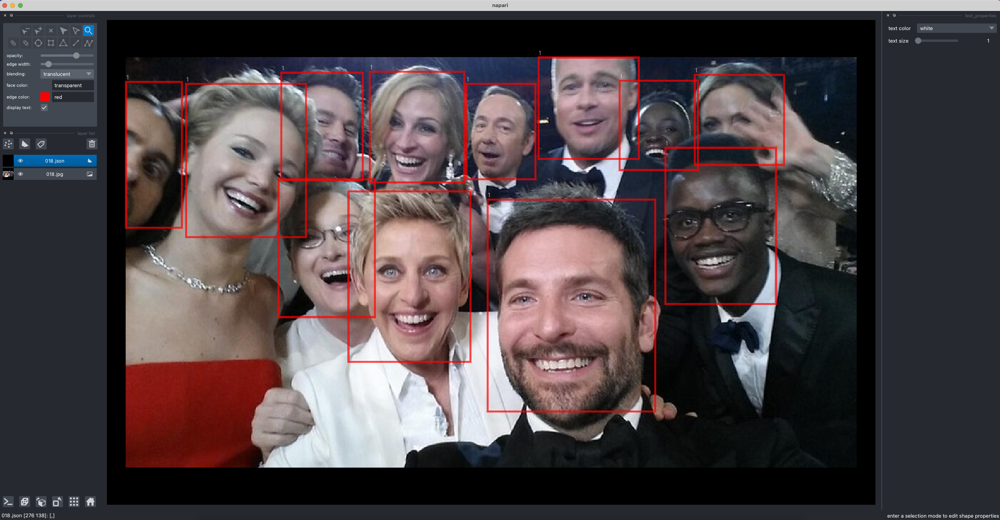

# PyTorch Faster-RCNN Tutorial

Learn how to start an **object detection deep learning project using
PyTorch and the Faster-RCNN architecture** in this beginner-friendly tutorial.
Based on the blog
series [Train your own object detector with Faster-RCNN & PyTorch](https://johschmidt42.medium.com/train-your-own-object-detector-with-faster-rcnn-pytorch-8d3c759cfc70)
by Johannes Schmidt.

## Summary

You can train the model using the [training script](training_script.py).

In addition, I provide jupyter-notebooks for various tasks such as
**creating & exploring datasets**,
**running inference** and
**visualizing anchor boxes**:

- [Dataset exploration](dataset_exploration_script.ipynb)
- [Data annotation](annotation_script.ipynb)
- [Anchor visualization](anchor_script.ipynb)
- [Inference](inference_script.ipynb)
- [Renaming script](rename_files_script.ipynb)

## Installation

After cloning the repository, follow these steps to install the dependencies in a new environment and start a jupyter
server:

1. Set up & activate a new environment with an environment manager (recommended):
    1. [poetry](https://python-poetry.org/):
        1. `poetry env use python3.10`
        2. `source .venv/bin/activate`
    2. [venv](https://docs.python.org/3/library/venv.html):
        1. `python3 -m venv .venv`
        2. `source .venv/bin/activate`
    3. [conda](https://docs.conda.io/en/latest/miniconda.html):
        1. `conda create --name faster-rcnn-tutorial -y`
        2. `conda activate faster-rcnn-tutorial`
        3. `conda install python=3.10 -y`

2. Install the libraries with **pip** or **poetry**:
    1. [poetry](https://python-poetry.org/):
        1. `poetry install` (poetry.lock)
    2. [pip](https://pip.pypa.io/en/stable/) (including conda):
        1. `pip install -r requirements.txt` (requirements.txt)

3. Start a jupyter server:
    1. `jupyter-notebook` (**not jupyter-lab**, because of a dependency issue with the neptune-client<1.0.0)

**Note**: This will install the CPU-version of torch.
If you want to use a GPU or TPU, please refer to the instructions
on the [PyTorch website](https://pytorch.org/).
To check whether pytorch uses the nvidia gpu, check
if `torch.cuda.is_available()` returns `True` in a Python shell.

**Windows user**: If you can not start jupyter-lab or jupyter-notebook on Windows because of
`ImportError: DLL load failed while importing win32api`, try to run `conda install pywin32` with the conda package
manager.

## Dependencies

These are the libraries that are used in this project:

- High-level deep learning library for PyTorch: [PyTorch Lightning](https://www.pytorchlightning.ai/)
- Visualization software: Custom code with the image-viewer [Napari](https://napari.org/)
- [OPTIONAL] Experiment tracking software/logging module: [Neptune](https://neptune.ai/)

If you want to use [Neptune](https://neptune.ai/) for your own experiments, add the API-Key to the `NEPTUNE` variable in
the [.env](.env) file.

Please make sure that you meet these requirements:

- python: [3.10](https://www.python.org/downloads/)
- neptune-client: [0.16.8](https://github.com/neptune-ai/neptune-client/releases/tag/0.16.18)
- napari: [0.4.17](https://github.com/napari/napari/releases/tag/v0.4.17)

## Dataset

The [dataset](src/pytorch_faster_rcnn_tutorial/data)
consists of 20 selfie-images randomly selected from the internet.

## Faster-RCNN model

Most of the model's code is based on PyTorch's Faster-RCNN implementation. Metrics can be computed based on
the [PASCAL VOC](http://host.robots.ox.ac.uk/pascal/VOC/) (**V**isual **O**bject **C**lasses) evaluator in
the [metrics section](src/pytorch_faster_rcnn_tutorial/metrics).

## Anchor Sizes/Aspect Ratios

Anchor sizes/aspect ratios are really important for training a Faster-RCNN model (but also similar models like SSD,
YOLO). These "default" boxes are compared to those outputted by the network, therefore choosing adequate sizes/ratios
can be critical for the success of a project. The PyTorch implementation of the AnchorGenerator (and also the helper
classes here) generally expect the following format:

- anchor_size: `Tuple[Tuple[int, ...], ...]`
- aspect_ratios: `Tuple[Tuple[float, ...]]`

### Without FPN

The ResNet backbone without the FPN always returns a single feature map that is used to create anchor boxes. Because of
that we must create a `Tuple` that contains a single `Tuple`: e.g. `((32, 64, 128, 256, 512),)` or `(((32, 64),)`

### With FPN

With FPN we can use 4 feature maps (output from a ResNet + FPN) and map our anchor sizes with the feature maps. Because
of that we must create a `Tuple` that contains exactly **4** `Tuples`: e.g. `((32,), (64,), (128,), (256,))`
or `((8, 16, 32), (32, 64), (32, 64, 128, 256, 512), (200, 300))`

## Examples

Examples on how to create a Faster-RCNN model with pretrained ResNet backbone (ImageNet) are provided in
the [tests section](tests). Pay special attention to
the test function `test_get_faster_rcnn_resnet` in [test_faster_RCNN.py](tests/test_faster_RCNN.py).
**Recommendation**: Run the test in debugger mode.

## Notes

- Sliders in the [inference script](inference_script.ipynb) do not work right now due to dependency updates.
- Please note that the library "neptune-client" is deprecated but the migration to "neptune" has not finished yet.
  Therefore, the library "neptune-client" is still used in this project.
